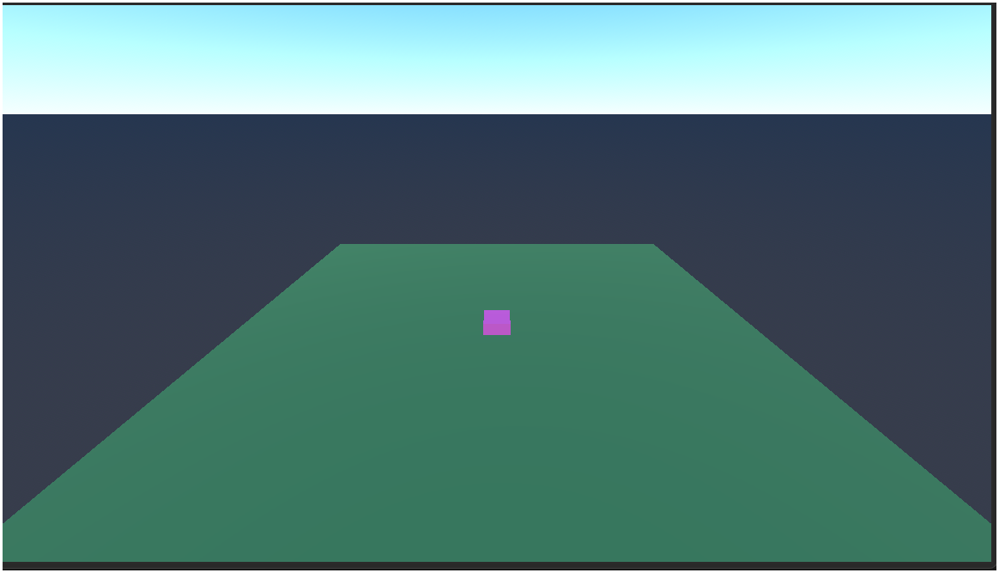
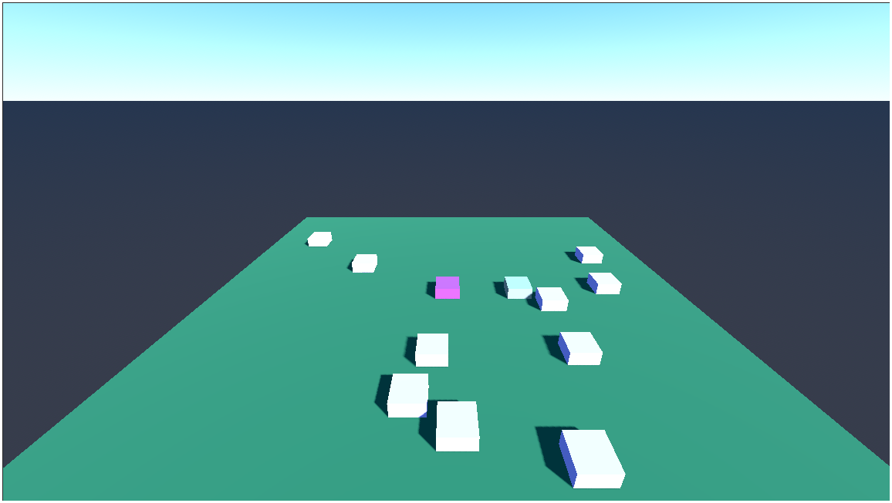

# 3D Exploration (Godot)

A 3D prototype built in Godot featuring player movement, physics collision, procedural object spawning, and basic lighting and shadows.

## Features
- **Player Movement**: Responsive movement controlled via keyboard input using Godot's `CharacterBody3D`.
- **Physics & Collision**: Physics-based ground collision utilizing character physics and static bodies.
- **Procedural Spawning**: Dynamic generation of rotating cubes distributed randomly across the environment at startup.
- **Lighting & Shadows**: Directional lighting setup featuring real-time shadow casting.

## Controls
- **WASD / Arrow Keys**: Move player

## Screenshots

### Player View

### Environment & Spawner

### Alternative Angle View

### Obstacle Navigation

### Real-Time Shadows

## Tech Stack
- **Engine**: Godot Engine
- **Language**: GDScript
